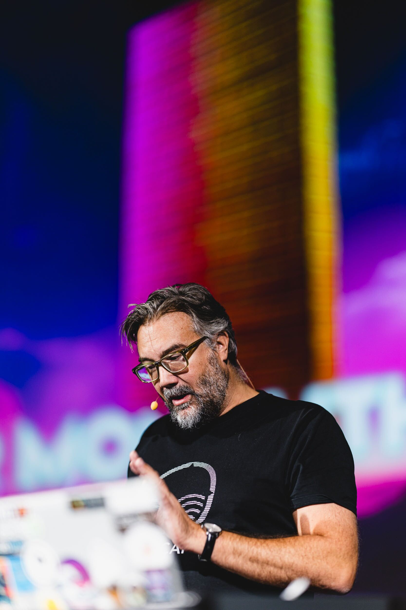

# Track record (of my talks)

__Thomas PIERRAIN__ (aka __[use case driven](https://twitter.com/tpierrain)__ on twitter)

## Bio
VP of Engineering in a booming European scale-up (Agicap) for tbe last 4 years, Thomas is a former entrepreneur, consultant, architect and eXtreme Programmer obsessed with use cases (as opposed to the solution-oriented approach that we tend to choose in our job a little too much) during more than 25 years. Also co-organizer of the DDD France (and former BDD Paris) meetups, Thomas likes to use autonomy, DDD and TDD to boost his efficiency and that of others at work.

Long-time promoter of hexagonal architecture (through articles, talks, trainings or live coding sessions - including one with Alistair Cockburn) Thomas is now advocating for a specific style of TDD called Outside-in Diamond 🔷 TDD . This fits perfectly with Alistair's pattern, and also allows for more secure, antifragile, and Domain-Driven tests to be written.

__More than 100 talks made worldwide since 2014__ (lots of live-coding sessions, talks, keynotes, etc) 

_Most well-known conferences I've made as speaker: DDD Europe (Amsterdam), µCon (London), Cukenfest (London), DDD eXchange (London), XP conf (Porto), Explore DDD (Denver), KanDDDinsky (Berlin), Devoxx France (Paris), Devoxx BE (Anvers), Voxxed Days Luxembourg, NewCrafts (Paris), FlowCon (France), Socrates Foundations Day (Soltau, Allemagne), Lean Kanban France (Paris), SoftShake (Genève), MS Experiences '16 (Paris), MixIT! (Lyon), BDX.io (Bordeaux), Sunny Tech (Montpellier), Agile Tour (Lille, Bordeaux), BreizhCamp (Rennes), SnowCamp (Grenoble), Alpes Craft (Grenoble), Expand conference (Amsterdam), School of Product (Paris), Codeurs en Seine (Rouen), French Ministry of Digital (Paris), Paris JUG (Paris)..._

---

(version Française)

VP of Engineering dans une grosse scale-up Européenne (Agicap) ces 4 dernières années, Thomas est un ancien entrepreneur, consultant, architecte et eXtreme Programmer obsédé par les usages (par opposition à l'approche orientée solution qu'on a un peu trop tendance à choisir dans notre métier). Également co-organisateur des meetups DDD FR et anciennement BDD Paris, Thomas aime utiliser le DDD et le TDD pour booster son efficacité et celle des autres au travail.

Promoteur de longue date du TDD et de l’Architecture Hexagonale (qu’il a même eu l’occasion de live-coder une fois aux côté d’Alistair Cockburn), Lors de ces 15 dernières années, Thomas a développé un style un peu particulier de TDD nommé : __Outside-In Diamond 🔷 TDD__. Celui-ci permet d’écrire des tests encore plus fiables, antifragiles, mais surtout orientés métier.

Un peu __plus de 100 talks réalisés depuis 2014 à travers le monde__ (pleins de sessions de live-coding, quelques keynotes et beaucoup de talks) 

_Les conférences les plus connues auxquelles j'ai pu intervenir en tant que speaker: DDD Europe (Amsterdam), µCon (London), Cukenfest (London), DDD eXchange (London), XP conf (Porto), Explore DDD (Denver), KanDDDinsky (Berlin), Devoxx France (Paris), Devoxx BE (Anvers), Voxxed Days Luxembourg, NewCrafts (Paris), FlowCon (France), Socrates Foundations Day (Soltau, Allemagne), Lean Kanban France (Paris), SoftShake (Genève), MS Experiences '16 (Paris), MixIT! (Lyon), BDX.io (Bordeaux), Sunny Tech (Montpellier), Agile Tour (Lille, Bordeaux), BreizhCamp (Rennes), SnowCamp (Grenoble), Alpes Craft (Grenoble), Expand conference (Amsterdam), School of Product (Paris), Codeurs en Seine (Rouen), French Ministry of Digital (Paris), Paris JUG (Paris)..._

---

## Blogs & writing
* [My articles on Medium](https://medium.com/@tpierrain) (+32)
* My former blog: http://tpierrain.blogspot.com/

## Topics of interest
Loving to speak with others and to live-code on stage, I'm a big fan of [Nancy Duarte's Resonate](http://www.duarte.com/book/resonate-legacy/). As a speaker, I try to *mainstream* things I do at work (DDD, Software Craftsmanship practices, Reactive Programming and low latency stuffs, Architecture, etc.).

This is a sum-up of all my public intervention & covered topics over the last years:

- __[2025](#in-2025)__ - The Hive (modular monotlith strategy), the DDD Horror picture show
- __[2024](#in-2024)__ - Process Comm, and High-speed DDD (revisited), The Hive (modular monotlith strategy)
- __[2023](#in-2023)__ - Process Comm, Autonomy and High-speed DDD
- __[2022](#in-2022)__ - Hypergrowth, Scale-up, Autonomy & (outside-in diamond) TDD, Hexagonal Architecture & the Hive pattern
- __[2021](#in-2021)__ - Product management, Beyond Hexagonal Architecture (Functional Core) & Outside-in Diamond  TDD
 - __[2020](#in-2020)__ - COVID-19 year. Nonetheless, I've made some stuffs about Hexagonal Architecture, DDD & a keynote about eXtreme Programming (eXtreme)
 - __[2019](#in-2019)__ - (Theater play about) strategic DDD, Process Comm, Event Storming & Example Mapping, CQRS/ES
 - __[2018](#in-2018)__ - Another keynote, Event Sourcing, Example mapping, Pair programming and...
 - __[2017](#in-2017)__ - Keynote & live coding sessions related to DDD, Legacy, Hexagonal Architecture and Event Sourcing
 - __[2016](#in-2016)__ - DDD, Network, Craftsmanship & Legacy
 - __[2015](#in-2015)__ - TDD, Hexagonal architecture & Craftsmanship
 - __[2014](#in-2014)__ - Reactive programming, & Refactoring techniques

---

## In 2025

#### NewCraft (Paris)
 - __The DDD horror picture show__ in english, with with [Pauline JAMIN](https://bsky.app/profile/paulinejamin.bsky.social) 

#### KanDDDinsky (Berlin)
 - __The DDD horror picture show__ in english, with with [Pauline JAMIN](https://bsky.app/profile/paulinejamin.bsky.social) 

#### Devoxx BE (Antwerp)
 - __[LIVE CODING The Hive: building a microservices ready modular monolith](https://www.youtube.com/watch?v=VKcRNtj0tzc):__ in english, with with [Julien Topçu](https://bsky.app/profile/julientopcu.com) 

#### Artisan Developpeur (podcast)
- __[Refactoring de la mort](https://artisandeveloppeur.fr/refactoring-de-la-mort-avec-thomas-pierrain/)__ : 

#### MixIT! (Lyon)
- __[Le pattern Hive : une stratégie de modularisation pour votre monolithe modulaire ou vos microservices](https://www.youtube.com/watch?v=TL_nVaOs47g)__: in french, with [Julien Topçu](https://bsky.app/profile/julientopcu.com)

#### Devoxx France (Paris)
- __[The DDD Horror Picture Show](https://www.youtube.com/watch?v=O0lEWaWaVYo)__: in french, with [Pauline JAMIN](https://bsky.app/profile/paulinejamin.bsky.social)

#### SnowCamp (Grenoble)
- __Le pattern Hive : une stratégie de modularisation pour votre monolithe modulaire ou vos microservices__: in french, with [Julien Topçu](https://bsky.app/profile/julientopcu.com)

---

## In 2024

#### KanDDDinsky (Berlin)
- __[The Hive: a scaling and supple architecture style for your growing and complex domain](https://youtu.be/JZBsy6PsCRY?si=mJoMVEyjAzu7IJ3F)__: with my friend Julien Topçu.  __[slides](https://slides.com/julientopcu/the-hive-a-scaling-and-supple-architecture-style-for-your-growing-and-complex-domain)__ / __[code](https://gitlab.com/beyondxscratch/hive-pattern)__

#### DevoxxFR (Paris)
 - __[High-Speed DDD (revisited)](https://www.youtube.com/watch?v=chOTMfhiNgs)__ : reviewed version of my Voxxed Luxembourg talk

 - __[Équilibrez le Stress, Maximisez la Collaboration : communiquez sans heurts à l’aide de la Process Communication (deep-dive intro)](https://www.youtube.com/watch?v=9vA2NciX1QQ)__ : a deep-dive introduction (180') of Process Communication (in french)

 
---

## In 2023

#### Voxxed Luxembourg (Luxembourg)

- [High-Speed DDD](https://www.youtube.com/watch?v=tAGG4-UtfGw) : talk about how to efficiently deliver software with impact, even with hard time-to-market constraints

#### DDD Europe (Amsterdam)

 - [The scale-up, The Autonomy and the nuclear submarine​](https://youtu.be/dAA9rVg6bb8?si=uBuPMQ4chNg0ylNM): reviewed version of our talk with [Pauline JAMIN](https://twitter.com/paulinejamin) about the challenges of fostering Autonomy in a scale-up context (lots of new discoveries). 

#### Agile Toulouse (Toulouse)

 - [Agile Toulouse Unconference](https://tour.agiletoulouse.fr/): (June 1-2 2023) Invited by the organization, I animated 5 sessions during this event:
    - Introduction to Process Communication (part 1, the basics)
    - Introduction to Process Communication (part 2, the toolbox)
    - Outside-in Diamond 🔷 TDD to write Antifragile & business-oriented tests (in discussion mode with the public)
    - Animation of "the office" kata carpaccio
    - and a whiteboard session in the sun to test the material of the future conference: DDD when everything goes too fast (aka. "High-Speed DDD").

---

## In 2022

#### SOCRATES Foundations Day (Soltau, Germany)
- [Hexagonal & Beyond](https://x.com/tpierrain/status/1562831178272763911?s=61&t=ECeI9dmgJTZyDVh5d4kQXQ): talk where I presented Hexagonal Architecture but also the Hive pattern during a first day dedicated to Foundations at Socrates Soltau. 

#### DDDFR (Lyon)
 - [Show me your domain: Cash Flow monitoring & forecasting](https://www.youtube.com/watch?v=FklGeG-2f_I&list=PLGl1Jc8ErU1wIRD0Of4nXLUecxjrjeJOk&index=1): talk with [Caroline DESPLANQUE](https://twitter.com/@carolinedpl) where we presented the domain of Cash flow Forecasting in front of our Context Map.  

#### Alpes Craft (Grenoble)
 - [Outside-in Diamond ◆ TDD pour écrire des tests Antifragiles & orientés métier](): long version (big Q & A session with a large audience) of this talk but the video capture of which was unfortunately lost.

#### Breizhcamp (Rennes)
 - [La scale-up, l'autonomie et le sous-marin nucléaire](https://www.youtube.com/watch?v=WurK0nYWcSM): talk with [Pauline JAMIN](https://twitter.com/paulinejamin) about the challenges of fostering Autonomy in a scale-up context.

#### Artisan developpeur (Remote)
- [Debrief Battle Artisan developeur](https://youtu.be/bbzQ5ZLc91Y): Discussion around the question: *Is Code quality compliant with startup?* (time to talk about Kent Beck 3X model, startups and scaling, code quality, Domain Driven Design, refactoring, staff engineering & roles)

- [Podcast Artisan developeur](https://compagnon.artisandeveloppeur.fr/veille/podcast-hypercroissance-et-economie-avec-thomas-pierrain) podcast about hypergrowth and autonomy.  

#### Devoxx FR (Paris)
 - [La scale-up, l'autonomie et le sous-marin nucléaire](https://youtu.be/FPZw6gy04T4): talk with [Pauline JAMIN](https://twitter.com/paulinejamin) about the challenges of fostering Autonomy in a scale-up context.

---

## In 2021
 - [De l'autre côté du miroir](https://youtu.be/yOBmGW-FGE8): Keynote for the opening of the **School of Product** (**Sept 21th in Paris**). A mix between Product management, Domain Driven Design and how to be efficient as dev team.
 - [Podcast sur le TDD, eXtreme Programming, le cargo cult](https://on.soundcloud.com/uWXusWDJppevTWf58)  (Remote)
 - [eXtreme](https://www.youtube.com/watch?v=AJLL4PZa54g): my eXtreme Programming talk made at TADx (Remote)
 - [Write Antifragile & Domain-Driven tests with ”Outside-in diamond” ◆ TDD](https://www.youtube.com/watch?v=djdMp9i04Sc&feature=youtu.be): a talk made for DDD Africa user group on how I ended up doing TDD for many years  (Remote)
 - [Live coding - Beyond the hexagonal architecture: Functional Core & ...](https://github.com/42skillz/livecoding-beyond-hexagonal-architecture/blob/main/README.md) The english version of our Functional Core live coding (with Bruno) at Virtual DDD  (Remote)

---

## In 2020
 - [eXtreme](https://youtu.be/xrqEsp4JUVY): a keynote about eXtreme Programming and its real specificity (Remote)
 - [Une nuit dans l'hexagone](https://www.youtube.com/watch?v=07x54QhhFFY) Fish-bowl panels at #DDDFR with french devs about their usages of Hexagonal Architecture (Remote)
 - [DDD clinic](https://www.youtube.com/watch?v=Cb7VDgcnOhk) A nice Q&A night with DDDFR and other European DDD specialists  (Remote)
 - [Functional Core, l’alternative FP à l’architecture hexagonale](https://www.youtube.com/watch?v=T_9mqhrY3QA) at "La rentrée des speakers" online conference. It was the first time Bruno and I were live-coding about Functional Core. (Remote)

## In 2019
### (Theater play about) strategic DDD, Process Comm, Event Storming & Example Mapping, CQRS/ES (Paris)
With a 3 acts Theater play (written by Bruno and I), a 2 days workshop about how to go from Problem space to solution space and another keynote, this year was very intense regarding writing and event preparation for me. I also discovered (and liked) the awesome Sunny Tech conference (in Montpellier) and was proud to be the keynoter for the first edition of AlpesCraft (in Grenoble).

### 2019 in details:

#### Parcours dev (Paris)
- [__Parcours dev__](https://anchor.fm/parcoursdev/episodes/Parcours-de-Thomas-Pierrain--architecte-et-passionn-par-les-usages-mtiers-e9aeq6)   Podcast parcours dev (avec Saad) ou on parle du wu-tang, de la magie et de logiciel aussi 

#### FlowCon France (Paris)
 - TBAnnounced : https://flowcon19.sched.com/speaker/thomas_pierrain.76q69ze

#### BDX.IO (Bordeaux)
 - [__Equiper sa voie__](https://www.youtube.com/watch?v=d0_ib2hs-04&list=PLUJzERpatfsXmxaQ1kBspqUrBAP25RDxM&index=14) My former AlpesCrafts keynote about my main take aways from 20 years of career but mostly about Process Communication techniques (psychology funded by NASA).

#### Explore DDD (Denver)
 - [Eventstorming and Example Mapping From Problem Space to Solution Space](http://exploreddd.com/2019/workshops/eventstorming-and-example-mapping-from-problem-space-to-solution-space.html) - The same 2 days workshops ran at DDDD Europe. 

#### Expand conference (Amsterdam)
 - [Experience Event Storming with Example Mapping](https://pages.xebia.com/expand-conference-speaker-thomas-pierrain) - Same 2 hours hands-on session that has been ran at Cukenfest. 

#### Sunny Tech (Montpellier)
 - [Et si on parlait Ethique ?](https://openfeedback.io/3xWvprYgxf1Tzmsj6J51/2019-06-27/27) - former keynote from Agile Tour Bordeaux.

#### L'après-midi du DDD (épisode 2) - 3 acts, 9 speakers, 2 teams on stage (Paris)
 - [Theater play trailer with english subtitles](https://www.youtube.com/watch?v=IIFs9HnFx2U) 
 - [Full version of the 3 acts play](https://www.youtube.com/watch?v=PIo6jUl4VO8&t=13s)
 

#### AlpesCrafts (Grenoble)
 - [Equiper sa voie (keynote)](https://www.youtube.com/watch?v=c1H0VrAXWMU) My third keynote was about my main take aways from 20 years of career but mostly about Process Communication techniques (psychology funded by NASA).

#### µCon (London)
 - [Experience Event Storming with Example Mapping](https://skillsmatter.com/conferences/11982-con-london-2019-the-conference-on-microservices-ddd-and-software-architecture#program) Same 2 hours hands-on session that we ran at Cukenfest with Bruno BOUCARD. 

#### NewCraft (Paris)
 - [EventStorming and Example Mapping From Problem Space to Solution Space](https://ncrafts.io/speaker/tpierrain) A 1 day version of the workshop we ran at DDD Europe, with Kenny BAAS-SCHWEGLER and Bruno BOUCARD. 

#### Cukenfest (London)
 - [Experience an Energized Event Storming with Example Mapping](https://cucumber.ghost.io/blog/cukenfest-asks-bruno-boucard-and-thomas-pierran/) A 2 hours hands-on session with Bruno BOUCARD. 

#### DDD Europe (Amsterdam)
 - [EventStorming and Example Mapping towards solution space](https://training.dddeurope.com/event-storming-example-mapping/) with Kenny BAAS-SCHWEGLER and Bruno BOUCARD. 
 
#### Café Craft podcast
 - __CQRS et EventSourcing__ https://podcasts.apple.com/fr/podcast/larchitecture-cqrs-et-eventsourcing-avec-thomas-pierrain/id1294016248?i=1000433850284  and https://www.cafe-craft.fr/32-bonus  

#### Artisan développeur podcast
 - __L'émancipation des devs__ https://artisandeveloppeur.fr/lemancipation-des-developpeurs-avec-thomas-pierrain/ 
 
 - __C'est quoi le DDD__ https://compagnon.artisandeveloppeur.fr/veille/podcast-c-est-quoi-le-ddd-avec-thomas-pierrain 
 

## In 2018
### Another keynote, Event Sourcing, Example mapping, theatratical Pair programming...
The year started quite well with 2 sessions at the amazing [DDD Europe](https://dddeurope.com/2018/) conference where I talked about Bi-temporal Event Sourcing and live-coded with Bruno (with an amazing and interactive audience). A couple of weeks after, Bruno and I animated a workshop about Example Mapping during the first edition of the [School of PO](https://laconf.schoolofpo.com/). 

The very same Example Mapping workshop that we animated during [NewCrafts Paris](https://ncrafts.io/speaker/tpierrain), where I also had the chance to talk about Bi-temporal Event Sourcing (but with a brand new talk about technical challenges this time).

Then, Bruno and I did a live-coding talk illustrating the power (and challenges) of Pair Programming at [Explore DDD (Denver)](http://exploreddd.com/speakers/thomas-pierrain.html) in September and then in french at [BDX.IO](https://www.bdx.io/#/home) and  __[Becomx](http://becomx.com/)__.

Last but not least, I've made __[a keynote in french about ethics](https://www.facebook.com/582109264/posts/10156742368324265/)__ related to how software is eating the world where I talked a lot about privacy and how the "free app" model was impacted our lives much deeper than we think.

### 2018 in details:

#### Becomx (__[Becomx](http://becomx.com/)__)
 - __Pair ou impairs ? (live-coding sanglant)__ like we did qt BDX.IO

#### BDX.IO
 - [Pair ou impairs ? (live-coding sanglant)](https://www.youtube.com/watch?v=RiVSIbkss6A&t=0s&list=PLUJzERpatfsWJ6qlXnlCPC5g0nFQN7Z5N&index=11), like the one we did at Explore DDD with Bruno BOUCARD, but in french this time.
 
 - __Example mapping workshop__: a nice edition of our regular Example mapping workshop.

#### Agile tour Bordeaux
 - Closing Keynote: [Et si on parlait un peu Ethique?](https://www.facebook.com/582109264/posts/10156742368324265/) in french. Note: it really starts after 11m 26sec

#### KanDDDinsky (Berlin)
 - __Distill the Core Domain from Your Legacy App__: probably the last time where Bruno BOUCARD and myself were doing our 2 hours of live-coding on how to refactor Legacy code using DDD tactical patterns 
 - Bruno and I have also helped our friend Kenny Baas-Schwegler to animate his 2 hours workshop mixing Event Storming and Example Mapping.
 

#### Explore DDD (Denver)
 - [Communication Is Everything; Especially While Pairing (Survival Guide)](https://www.youtube.com/watch?v=e1yLmYN0hXk) the very first version of our theatratical talk about Pair Programming with Bruno BOUCARD 

#### Domain from the trenches (DDD Paris main event)
 - [My very first experience of DDD](https://www.youtube.com/watch?v=GDxXOX2Vgt0&list=PLGl1Jc8ErU1wcFdxzRr33ZoP_94B_1CGe&index=4) a short talk where Jéremie GRODZISKI and I talk about our very first experience of DDD at work. Talk in french but with subtitles in 

- [All videos from this main event](https://www.youtube.com/playlist?list=PLGl1Jc8ErU1wcFdxzRr33ZoP_94B_1CGe). Most of the talks are in  but those in french have english subtitles.

#### Newcrafts Paris
 - [As time goes by… (technical challenges of bi-temporal Event Sourcing)](https://vimeo.com/275529977) 

- Discover Example Mapping: the real essence of BDD (with Bruno BOUCARD)

#### DDDeXchange (London)
 - [How to distill the core domain from your legacy app (live-coding)](https://skillsmatter.com/skillscasts/11582-how-to-distill-the-core-domain-from-your-legacy-app-live-coding)  

#### Devoxx FR
 - [Du DDD dans mon legacy (Université tout en live-coding)](https://www.youtube.com/watch?v=dzKKqS5ewLg) avec Jérémie GRODZISKI et Bruno BOUCARD.

#### School of PO
 - [Example mapping par la pratique](https://laconf.schoolofpo.com/speakers/thomas-pierrain/)

#### DDD Europe (Amsterdam)
 - [As Time Goes By… (a Bi-temporal Event Sourcing story)](https://dddeurope.com/2018/speakers/thomas-pierrain/) 
 
 - [Distill the Core Domain from Your Legacy App](https://www.youtube.com/watch?v=F3DV9YDeA6Q) 
 

## In 2017
### Keynote & live coding sessions related to DDD, Legacy, Hexagonal Architecture and Event Sourcing
Incredibly intensive year for me as a speaker with many various topics (11 different talks), including a first experience of an [opening keynote at BDX.IO](https://www.youtube.com/watch?v=bcJgvF-dHfs) and a keynote at the French Ministry of Digital. 

#### Seven talks in seven weeks ;-)
For once, all my CFP had been accepted (cool!) and I experienced a intensive period at the end of the year with [5 conf, 8 sessions, 7 diff talks (including 2 live codings and 2 workshops) in 7 consecutive weeks... ](https://twitter.com/tpierrain/status/921645425119113216).

### 2017 in details:

#### Lean Kanban France (LKFR)
 - [Event Storming (workshop)](http://2017.leankanban.fr/sessions/event-storming/) with Bruno BOUCARD

#### Codeurs en seine
 - [Hexagonal from scratch (live-coding)](https://www.youtube.com/watch?v=RLffRH9-IZY)

#### Agile Tour Lille
 - [Du DDD dans mon legacy! (live-coding)](http://2017.agiletour-lille.org/conferences/#ddd_legacy) with Bruno BOUCARD

#### BDX.IO
 - Opening Keynote: [Sortir de sa zone de confort](https://www.youtube.com/watch?v=bcJgvF-dHfs)
 - [Du DDD dans mon legacy! (live-coding)](https://www.youtube.com/watch?v=StFR5uC8jEY) with Bruno BOUCARD

#### SoftShake (Geneva)
 - [The art of Software Design](https://www.kora.li/admin.html#/index/p?u=jgrodziski&s=the_art_of_software_design&c=softshake&e=2017) with my friend Jeremie GRODZISKI
 
#### French Ministry of Digital - Ministère Français du numérique
 - [L'agilité à grande échelle : conservez l'esprit, pas la lettre](https://fr.slideshare.net/ThomasPierrain/lagilit-a-grande-chelle-conserver-lesprit-pas-la-lettre)  (October 6th 2017)

#### Explore DDD (Denver)
 - [How To Distill The Core Domain From Your Legacy App (Live Coding)](https://www.youtube.com/watch?v=mZzPwt9vhHM) with Bruno BOUCARD 

#### DDD Paris
- [As time goes by (a bi-temporal Event sourcing story)](https://www.meetup.com/fr-FR/DDD-Paris/events/244303073/)

- [Strategical patterns of DDD (workshop)](https://www.meetup.com/fr-FR/DDD-Paris/events/244069780/)

Two major events in June (both in live-coding): 
 - __[L'après-midi du Domain Driven Design](https://www.meetup.com/fr-FR/DDD-Paris/events/238799479/)__ : a crazy afternoon of { DDD + legacy code + live-coding } with __Bruno BOUCARD__ and __Jérémie GRODZISKI__ at Microsoft France. __[Vidéos available here](https://www.youtube.com/playlist?list=PLGl1Jc8ErU1xmSImIQ27Biu46C4MQHTfK)__
 - __[Alistair in the Hexagone](https://www.meetup.com/fr-FR/DDD-Paris/events/240715351/)__: an exceptional event end of June in Paris where Alistair clarified his pattern (and other related things) and where I live-coded next to him to illustrate it. Fun! __[Vidéos available here](https://www.youtube.com/playlist?list=PLGl1Jc8ErU1w27y8-7Gdcloy1tHO7NriL)__ 
 

- [The art of Software Design](https://www.youtube.com/watch?v=YijGE2nq2BY) with Jérémie Grodziski
    - [slides](https://www.slideshare.net/ThomasPierrain/the-art-of-software-design)
    
#### Devoxx FR
- [Legacy Club](https://www.youtube.com/watch?v=zeogtrxqc38) with Bruno Boucard
    - [slides](https://www.slideshare.net/ThomasPierrain/legacy-club-english-version)

#### MixIT!
- [Legacy Club](https://vimeo.com/215728093) with Bruno Boucard
    - [slides](https://www.slideshare.net/ThomasPierrain/legacy-club-english-version)

## In 2016 

### DDD, Network, Craftsmanship & Legacy
This year, I started trying __[to reboot Domain Driven Design](http://domain-driven-design.eu/reboot)__ (DDD) with [Jérémy GRODZISKI](https://twitter.com/jgrodziski) (at DevoxxFR, then NCrafts.io). Our main objective was to make DDD wisdom & efficiency __more mainstream__. We had lots of fun to make it live but I have to admit that I'm very happy to see that this subject has met its target audience at the end of the day (being [one of the most viewed video from the last Devoxx FR](https://www.youtube.com/watch?v=o3thkx3EuiA))

Another intense moment for me at DevoxxFR was the 3 hours talk of *network mechanical sympathy* we've made with [Raphaël Luta](https://twitter.com/raphaelluta) and my friend [Cyrille Dupuydauby](https://twitter.com/Cyrdup): [Pourquoi il ne suffira pas de faire du HTTP 2.0 pour faire des applications performantes](https://www.youtube.com/watch?v=GL-euKX5XEk). We didn't have too much time to prepare it (I was very busy with the elaboration of the DDD reboot talk) but *explaining how TCP works with post-its, buckets and the audience -as the network- was really fun*. While preparing this talk, I was very impressed by Raphaël's knowledge about network and performance.

I also continued __to promote Software Craftsmanship__ this year during mainstream events with my mate [Bruno BOUCARD](https://twitter.com/brunoboucard) (at Paris JUG, during the MS experiences'16, etc.). Lots of interesting interactions with people. The climax being the __Microsoft experiences'16__ event in Paris (i.e. the new version of MS tech days in the *Palais des congrès*). After the success of our previous *Learn to craft* event at MS France last year (with [Jean-Laurent](https://twitter.com/morlhon)), Bruno and I were offered the animation of 3 sessions related to *Software Craftsmanship*. We then decided to illustrate the wide spectrum of it: from the business requirements (via Event Storming), to the app implementation (using CQRS and hexagonal architecture), including the deployment (with Docker). We also decided to ask some help from my friend [Tomasz Jaskula](https://twitter.com/tjaskula) for the animation (he was a great *domain expert* for the Event Storming BTW). The CQRS session was an opportunity for me to discover ASP.NET MVC with *dotnetcore* (to allow Docker deployment). I also drop [my CQRS sample app on github](https://github.com/tpierrain/CQRS) few days before. Putting it to github was really an interesting move since I got feedbacks from friends and experts just before the MS event.

Last but not least, I'm very proud of the __[Legacy Club](https://twitter.com/tpierrain/status/786848848660553728)__ session we built with Bruno. __A mix of inspirational storytelling, live-code and advanced techniques of refactoring__. We played it once at Agile Tour Lille (with [nice feedbacks](https://twitter.com/antoniolopezg/status/786856429386948609)), and I hope that we will have many other occasions to meet people with it again. We've been invited to play it at Lean Kanban France (we will slightly remaster it for the occasion; i.e. reducing the live-coding parts in order to improve the storytelling one).

Just before XMas, I also made a 30 minutes talk about [MS Async-Await and its related pitfalls](http://www.slideshare.net/ThomasPierrain/async-awaitoh-wait) at alt.net meetup.

### 2016 in details:

#### LeanKanban FR
    
- [Legacy Club](https://www.infoq.com/fr/presentations/lkfr-boucard-pierrain-legacy-club) with Bruno Boucard
    - [slides](https://www.slideshare.net/ThomasPierrain/legacy-club-english-version)
    
#### AltNet.FR
 - [Async, Await, oh...wait!](http://www.slideshare.net/ThomasPierrain/async-awaitoh-wait)
 

#### Agile Tour Lille
- __[Legacy Club](https://twitter.com/tpierrain/status/786848848660553728)__, with Bruno Boucard
- DDD: et si on reprenait l'histoire par le bon bout ? with Jérémie Grodziski 

#### MS Experiences '16 
    
- [Découvrir son sujet grâce à l'EventStorming](https://experiences.microsoft.fr/Event/session/atelier-1-decouvrir-son-sujet-grace-a-levent/2a6658ef-4074-e611-80c3-000d3a2229a6) with Bruno Boucard, Tomasz JASKULA & Eric Vernié
    - [slides](http://fr.slideshare.net/ThomasPierrain/decouvrir-son-sujet-grace-levent-storming)
    - [Pics](https://twitter.com/tpierrain/status/783678783106740224)

- [Découvrir CQRS par la pratique](https://experiences.microsoft.fr/Event/session/atelier-2-decouvrir-cqrs-par-la-pratique/6d4195a5-4174-e611-80c3-000d3a2229a6#UcdWr4guZXZ7HlAB.97) with Bruno Boucard, Tomasz JASKULA & Eric Vernié
    - [slides](http://fr.slideshare.net/ThomasPierrain/decouvrir-cqrs-par-la-pratique-67526638) 

#### DDDx London 
- Let's reboot DDD! (improvised during the unconf part, but in the big room ;-) with Jérémie Grodziski 
    - [slides](http://fr.slideshare.net/ThomasPierrain/ddd-reboot-english-version)

#### Agile France
- DDD: et si on reprenait l'histoire par le bon bout ? with Jérémie Grodziski

#### NCrafts.io
- [Let's reboot DDD!](https://vimeo.com/167722768) with Jérémie Grodziski 

#### Paris JUG
- [Soirée Software Craftsmanship](https://www.youtube.com/watch?v=Cov4MGzozSA) with Bruno Boucard, Diego Lemos and myself. (pics [here](https://www.parisjug.org/xwiki/wiki/oldversion/view/Meeting/20160209)) 

#### Devoxx FR
- [DDD: et si on reprenait l'histoire par le bon bout ?](https://www.youtube.com/watch?v=o3thkx3EuiA) with Jérémie Grodziski 
- [Pourquoi il ne suffira pas de faire du HTTP 2.0 pour faire des applications performantes](https://www.youtube.com/watch?v=GL-euKX5XEk) with Raphaël LUTA & Cyrille DUPUYDAUBY

---

## In 2015

### TDD, Hexagonal architecture & Craftsmanship
I started the year with a 3 hours talk at Devoxx FR about *Hexagonal Architecture* with [Cyrille Martraire](https://twitter.com/cyriux). Despite the fact that i) I know the topic, ii) I've written blog posts on it, and iii) Cyrille and I have already made a 30 minutes talk on it at Société Générale... I have to admit that this 3 hours *university* format was probably the most stressing experience of my entire speaker carreer (due to the lack of time we had to prepare it). At the end of the day it was some kind of Miracle ;-) We had great time and __have probably successfuly animated the biggest architecture dojo ever ;-) with more than 800 people in the room)__. 

During Devoxx this year, I also made a [Culture Craft](http://fr.slideshare.net/ThomasPierrain/culture-craft-humantalks) lightning talk that has resonate a lot with the audience (in a nutshell, I provide tips and tricks on how to wake-up and change your team or organisation's culture). This is the very same talk I've played afterwards during a *human talk* evening hosted in SocGen.

The second part of the year was dedicated to TDD with my friend Bruno Boucard. Initially motivated to talk about our developper's mental models, we end-up with a talk about TDD, trying to explain the big picture of it and giving tips and tricks for people to successfully retry the experience (note: being exclusively practicing TDD since 2005, I've probably made all possible errors with it ;-) We played it a lot to conferences or during Brown Bag Lunch sessions, and the feedback on it was very positive. 

We end up by writing a serie of french article about TDD in Programmez (see. __[Le TDD comme rempart contre nos biais](TDDCommeRempartContreNosBiais-Programmez.pdf)__) 

### 2015 in details:

### Devoxx FR 
- [Coder sans la peur du changement avec la -même pas mal- architecture hexagonale](https://www.youtube.com/watch?v=wZ7cxcU4iPE) avec Cyrille Martraire - University format (3 hours)
- [Culture Crafts](http://fr.slideshare.net/ThomasPierrain/culture-craft-devoxx2015) - lightning talk (15 minutes) 

### MixIT Lyon
- [Si le TDD est mort, alors pratiquons une autopsie](http://fr.slideshare.net/brunoboucard/si-le-tdd-est-mort-alors-mix-it) with Bruno Boucard

### NCraft.io
- [TDD is dead?!? Let's do an autospy](http://videos.ncrafts.io/video/130256612) with Bruno Boucard 

### Agile France
- Si le TDD est mort, alors pratiquons une autopsie, with Bruno Boucard

### Agile Tour Lille 
- Si le TDD est mort, alors pratiquons une autopsie, with Bruno Boucard
- [Diamond kata coding dojo](http://fr.slideshare.net/brunoboucard/diamond-kata-agile-tour-lille) with Bruno Boucard

### Learn to craft: l'après-midi du Software Craftsmanship chez microsoft
With [Bruno Boucard, Jean-Laurent de Morlhon and myself](https://brunoboucard.com/2015/09/02/laprs-midi-du-software-craftsmanship-pour-les-dveloppeurs-net-ou-pas/)

- TDD and pair programming in a nutshell (live coding session) with Bruno Boucard

- Refactoring de code legacy avec des tucs en "N" (live coding session)

Some feedbacks (in french) are available [here](http://www.softfluent.fr/blog/expertise/2015/11/03/L-apres-midi-du-Software-Craftsmanship-chez-Microsoft-nous-y-etions) and [there](https://blog.goood.pro/2015/11/16/retour-sur-learn-to-craft-lapres-midi-du-software-craftsmanship/)

### Lean Kanban France
- __Si le TDD est mort, alors pratiquons une autopsie__, with Bruno Boucard

### Humantalks Paris
- [Culture Craft (lightning talk)](http://fr.slideshare.net/ThomasPierrain/culture-craft-humantalks)

### Brown Bag Lunchs
- a lot... (at Betclic, Ullink, Criteo, Air France, Université Paris XIII,...)

---

## In 2014

### Reactive programming, & Refactoring techniques
First year for me as a public speaker, I've studied a lot and trained very hard to make it work (verbal, non-verbal). Discovering by chance what I consider the best book ever written for public speakers (*Resonate*, by Nancy Duarte), I was thrilled to share this discovery with my mate [Cyrille Dupuydauby](https://twitter.com/Cyrdup) and to use it with him in order to build our "[Basses latences, hauts débits : les secrets de la finance pour avoir des systèmes réactifs](https://www.youtube.com/watch?v=SHptUbGxXMU)" talk. Considering the warm feedbacks we had and the number of time we played this talk about Reactive Programming over the years (the core concepts, not the trendy libraries), this was a really good investment ;-)

Loving to live-code, I was also pleased to play [Refactoring de code legacy avec des trucs en "N"](https://youtu.be/I3rNyxnD7as?si=72i05LgimB92fl7h) here and there. Impressed by [David Gageot](https://twitter.com/dgageot)' usage of Golden Master to refactor legacy code in Java, I had decided to make a .NET ecosystem version of it to share it with non-java audience.

### 2014 in details:

### Devoxx FR 
- [Basses latences, hauts débits : les secrets de la finance pour avoir des systèmes réactifs](https://www.youtube.com/watch?v=SHptUbGxXMU) with Cyrille DUPUYDAUBY

### Meetup Alt.NET
- [As you meant it (NFluent)](http://fr.slideshare.net/ThomasPierrain/nfluent-brown-bag-lunch-january-2014)

### Mug Lyon
- [Refactoring de code legacy avec des trucs en "N"](https://youtu.be/I3rNyxnD7as?si=72i05LgimB92fl7h) (live coding)

### Brown Bag Lunchs
- a lot...

.
